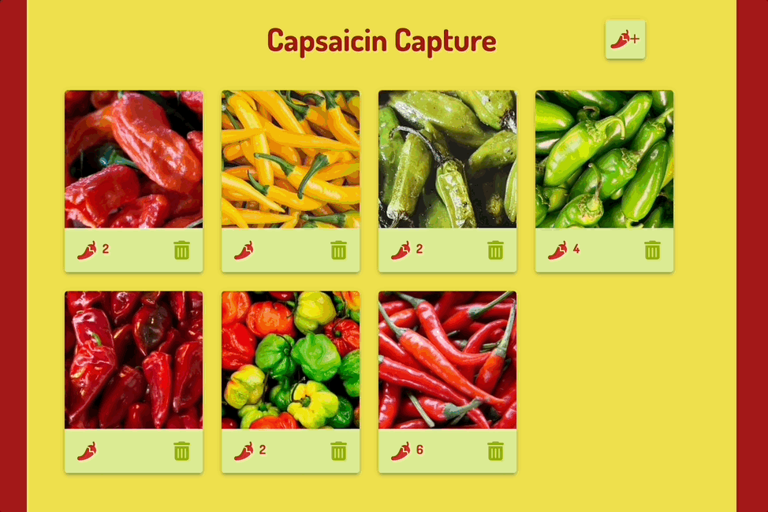

# Capsaicin Capture - A React Photo Gallery

## Description

Capsaicin Capture is a React gallery for true pepper fiends. Add images and descriptions of your favorite peppers. Love a particular variety? Let it be known by mashing that pepper button. Not a fan of another? Trash it! When you're ready to return to the gallery, fear not, because your precious pepper data is stored in a database. 

## Demo

       

### Prerequisites

- [Node.js](https://nodejs.org/en/)
- [Nodemon](https://www.npmjs.com/package/nodemon)
- [PostgreSQL](https://www.postgresql.org/)
- [Postico](https://eggerapps.at/postico/)

## Installation

1. Create a database named `react_gallery` in Postico.
2. Execute the query from `database.sql` in Postico to create the `gallery` table. 
3. Within your code editor, open a terminal window and install the dependencies by running:
    - `npm install`
4. Run `npm run server` in one terminal window. Open a second terminal window, and run `npm run client`. Access the application at `localhost:3000` in the browser.

## Usage

1. View the pepper type by clicking on the image. Click the pepper type to switch back to the image.
2. Like an existing image by clicking on the red pepper icon under the image. 
3. Delete an image by clicking the trash icon. The image is also deleted from the database. 
4. Add a new image by clicking the pepper plus button at the top of the page. Enter information into the `Pepper Type` and `Image URL` fields. The information entered into `Pepper Type` is what will display when the image is toggled. Click the red upload button to add. Click `x` to close or cancel.  

## Built With

React.js | Material UI | Axios | Node.js | Express | PostgreSQL
